# VMS System Flowcharts

Based on the `VMS_Complete_Flowchart_Manual.pdf`, here are the Mermaid diagrams representing the system flows and working.

## 1. System-Level Platform Ecosystem

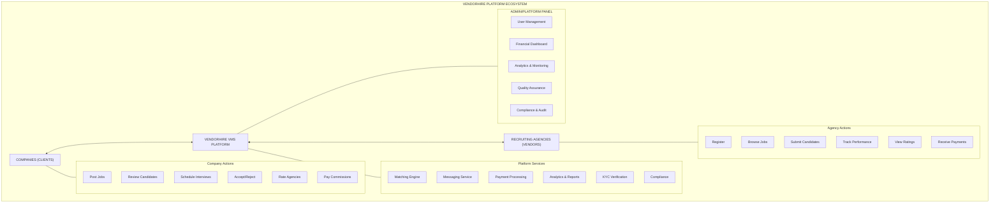

## 2. Complete Platform Process Flow (End-to-End Recruitment Lifecycle)

### Phase 1: Initialization (Registration & Verification)

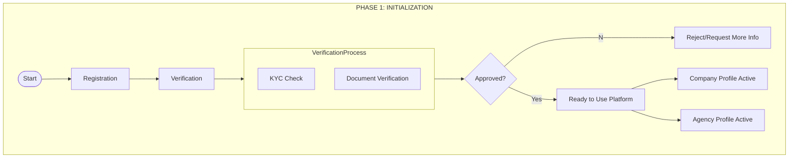

### Phase 2: Job Posting & Agency Matching

```mermaid
flowchart TD
    subgraph P2 ["PHASE 2: JOB POSTING & AGENCY MATCHING"]
        Company[Company] -->|Posts Job| JobForm
        
        subgraph JobDetails
            J1[Job Title]
            J2[Description]
            J3[Skills Required]
            J4[Salary Range]
            J5[Location]
            J6[Urgency Level]
            J7[Anonymous?]
        end
        
        JobForm --> JobDetails
        JobDetails --> Valid{Valid Input?}
        Valid --No--> Error[Error -> Retry]
        Valid --Yes--> Matching[Intelligent Agency Matching]
        
        subgraph Algorithm ["Matching Algorithm Considers"]
            A1[Agency Specialization]
            A2[Geographic Coverage]
            A3[Historical Success Rate]
            A4[Current Capacity]
            A5[Urgency Level]
            A6[Agency Performance Rating]
        end
        
        Matching --> Algorithm
        Algorithm --> Select[Select Top 5-10 Matching Agencies]
        Select --> Notify[Send Real-Time Notifications to Agencies]
        Notify --> Channels[In-App, Email, SMS]
        Channels --> AgenciesNotified[Job Posted & Agencies Notified]
    end
```

### Phase 3: Agency Job Discovery & Candidate Sourcing

```mermaid
flowchart TD
    subgraph P3 ["PHASE 3: AGENCY ACTIONS(Agency Job Discovery & Candidate Sourcing)"]
        Notify[Agency Receives Notification] --> Review[Review Job Details]
        Review --> Relevant{Job Relevant?}
        Relevant --No--> Skip[Skip / Mark Not Interested]
        Relevant --Yes--> Bid[Decide to Bid/Accept]
        
        Bid --> Accept[Accept Job Assignment]
        Accept --> StatusAssign[Status: ASSIGNED_TO_AGENCY]
        
        StatusAssign --> Source[Source Candidates]
        
        subgraph SourcingChannels ["Sources"]
            S1[Own Talent Pool]
            S2[LinkedIn/Job Boards]
            S3[Referrals]
            S4[Network]
        end
        
        Source --> SourcingChannels
        SourcingChannels --> Validate[Validate Candidates]
        
        subgraph Validation ["Validation Criteria"]
            V1[Skills Match]
            V2[Experience Level]
            V3[Salary Expectation]
            V4[Availability]
            V5[Profile Quality]
        end
        
        Validate --> Validation
        Validation --> Upload[Upload Qualified Candidates]
        
        subgraph SubmissionData ["Submission Data"]
            SD1[Resume/CV]
            SD2[Contact Details]
            SD3[Skills Profile]
            SD4[Experience Summary]
            SD5[Agency Remarks]
            SD6[Requested Salary]
        end
        
        Upload --> SubmissionData
        SubmissionData --> Submitted[Submission Created & Company Notified]
    end
```

### Phase 4: Candidate Review & Selection

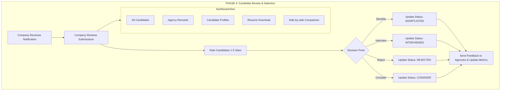

### Phase 5 & 6: Interview, Offer & Placement

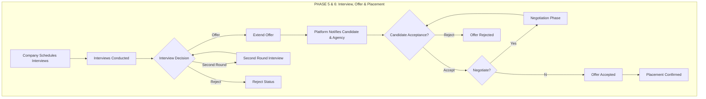

### Phase 7: Payment & Commission

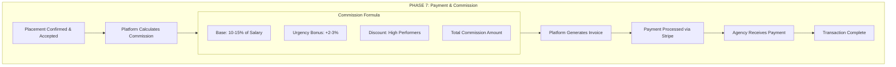

## 3. Company User Workflow (Detailed)

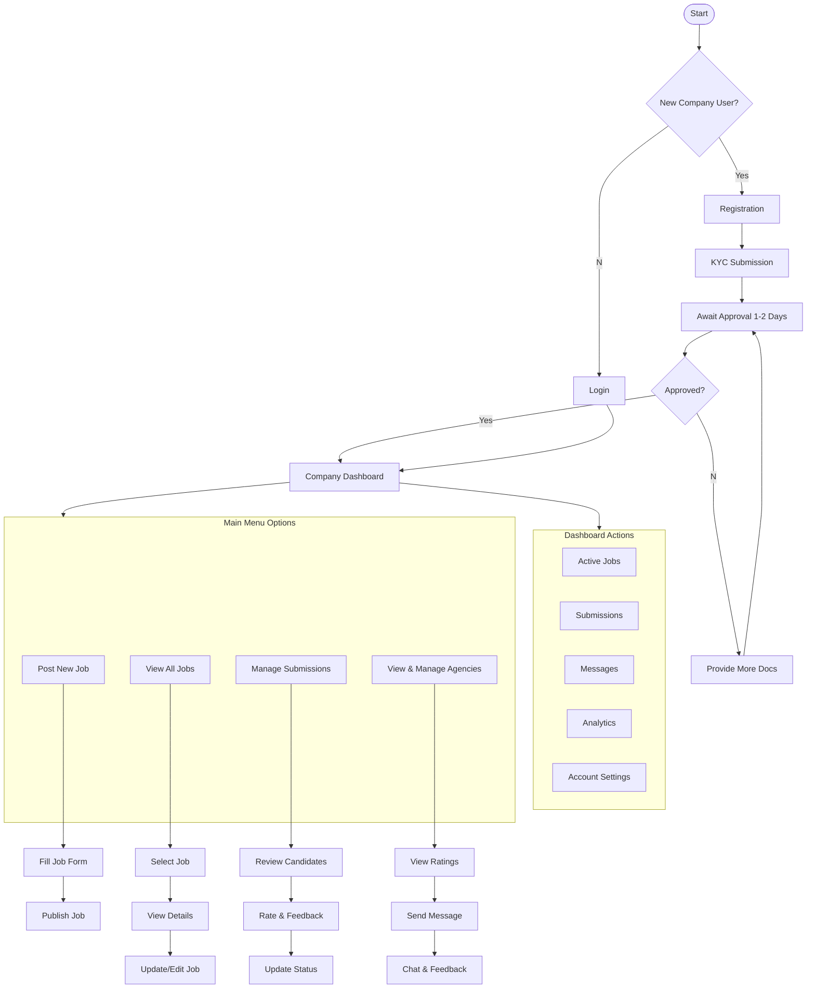

## 4. Recruiting Agency Workflow (Detailed)

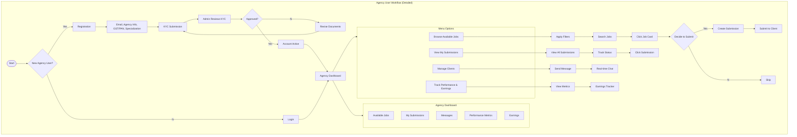

## 5. Data Flow: Job Posting to Notification (Sequence)

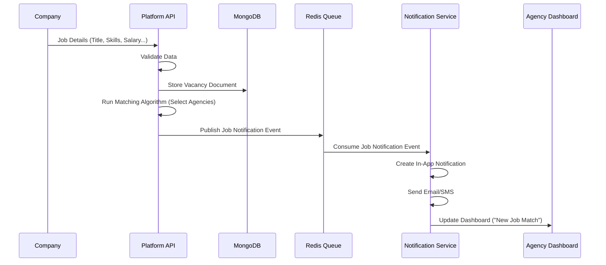

## 6. Data Flow: Candidate Submission (Sequence)

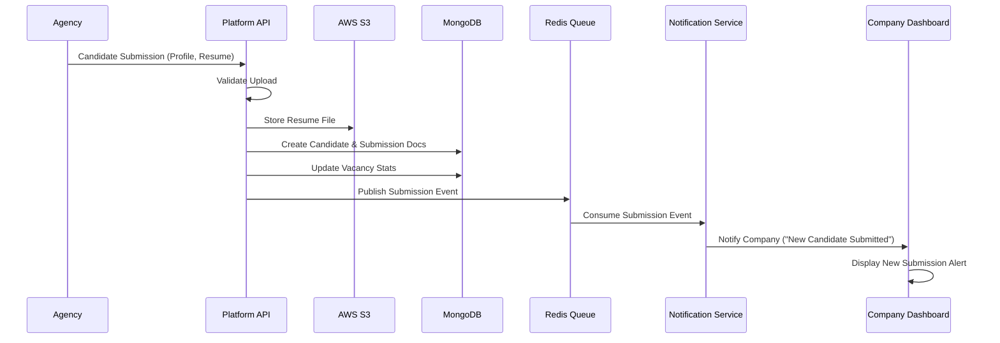

## 7. Data Flow: Payment & Commission (Sequence)

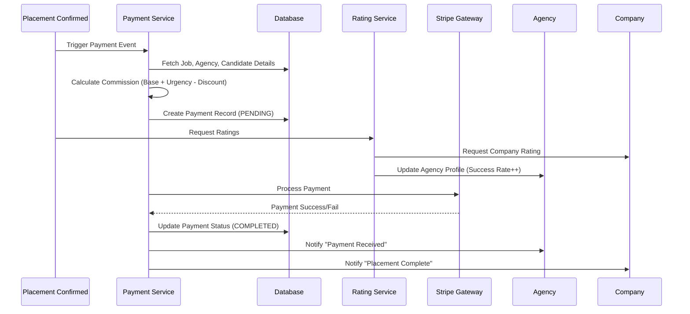
